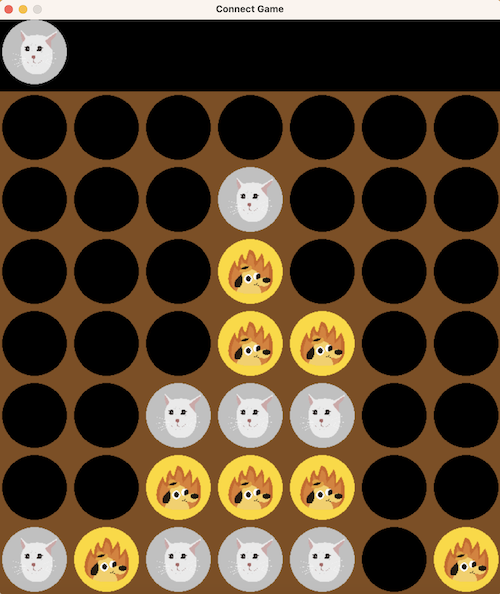

# ConnectX Game Environment

This repository contains the implementation of a Connect Game Environment using OpenAI's Gym and Pygame for rendering. The environment supports various game modes like Connect 4 and includes features like GUI display, avatar support for players, and different modes of player interaction (human, random).




## Table of Contents

- [Description](#description)
- [Installation](#installation)
- [Usage](#usage)
- [Setting Player Mode](#setting-player-modes)
- [Parameters](#connectgameenv-class)

## Description

The Connect Game Environment is a customizable and interactive environment for simulating Connect-style games. It leverages the OpenAI Gym interface for standard reinforcement learning interactions and uses Pygame for graphical rendering. The environment allows for different configurations of the board size and connect length and includes support for different player types, including human players and random agents.

## Installation

To use this environment, you need to have Python installed. You can install the necessary packages using `pip`:

```bash
pip install gymconnectx
```

## Usage

```
import gymconnectx


def run_game_env():
    env = gymconnectx.gym.make('gymconnectx/ConnectGameEnv',
                               connect=4,
                               width=7,
                               height=6,
                               reward_winner=1,
                               reward_loser=-1,
                               reward_living=0,
                               reward_draw=0.5,
                               reward_hell=-0.5,
                               max_steps=100,
                               delay=100,
                               square_size=100,
                               avatar_player_1='img_cat.png',
                               avatar_player_2='img_dog.png')
    env.reset()

    while not env.is_done and env.current_step < env.max_steps:
        try:
            move = env.set_players(player_1_mode='random', player_2_mode='random')
            observations, rewards, done, _, info = env.step(move)
            env.render(mode='terminal_display')
            env.render(mode='gui_update_display')

            print(f'Observation: {observations}')
            print(f"Step: {env.current_step}, "
                  f"Move: {move}, "
                  f"Rewards: {rewards}, "
                  f"Done: {done}, "
                  f"Info: {info}")

            print(env.get_game_status())

            if done:
                break
            else:
                env.current_step += 1

        except Exception as e:
            print(f"An error occurred: {str(e)}")
            break


if __name__ == "__main__":
    run_game_env()
```

## Setting Player Modes
You can set different player modes using the set_players method. Here are some examples:

### Example 1: Both Players Make Random Moves
```
move = env.set_players(player_1_mode='random', player_2_mode='random')
```

### Example 2: Player 1 Makes Moves Through the Terminal, Player 2 Makes Random Moves
```
move = env.set_players(player_1_mode='human_terminal', player_2_mode='random')
```

### Example 3: Player 1 Makes Moves Through the GUI, Player 2 Makes Random Moves
```
move = env.set_players(player_1_mode='human_gui', player_2_mode='random')
```

### Example 4: Player 1 Makes Moves Through the GUI, Player 2 Follows a Custom Policy
```
if env.get_current_player() == 1:
    move = env.set_players(player_1_mode='human_gui')
else:
    move = env.get_action_random()  # Add your policy here
```

### Example 5: Both Players Make Moves Through the GUI
```
move = env.set_players(player_1_mode='human_gui', player_2_mode='human_gui')
```

# ConnectGameEnv Class

The `ConnectGameEnv` class is designed to simulate a Connect 4-like game environment, allowing customization through various parameters to accommodate different rules and interfaces. Below are the parameters it accepts:

Please use this bibtex if you want to cite this repository in your publications:

    @misc{gymconnectx,
      author = {Sholichin, Fauzi},
      title = {ConnectX Game Environment},
      year = {2024},
      publisher = {GitHub},
      journal = {GitHub repository},
      howpublished = {\url{https://github.com/fauzisho/GymConnectX}},
    }
